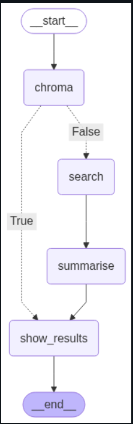
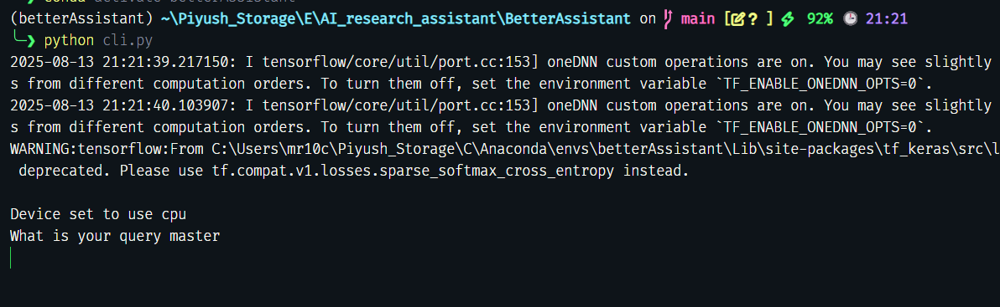
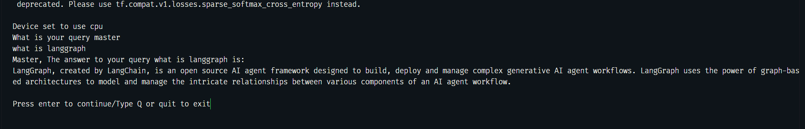
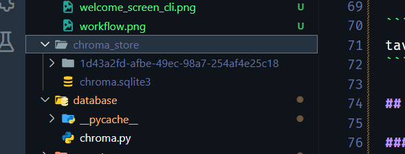
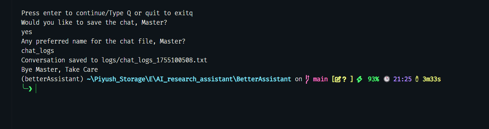
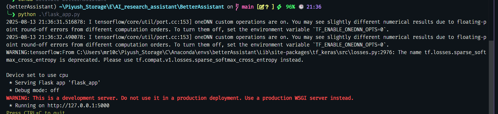
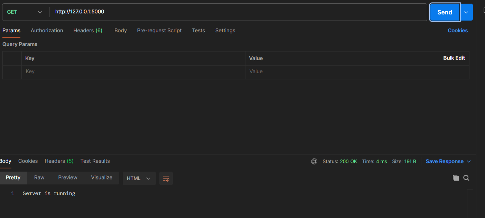
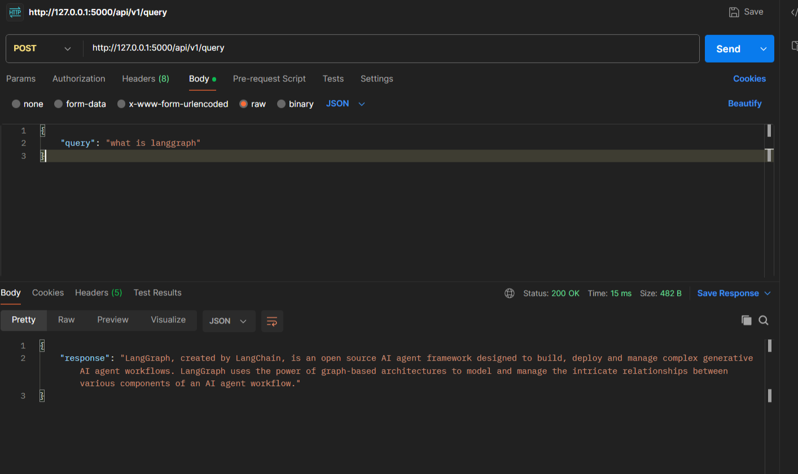
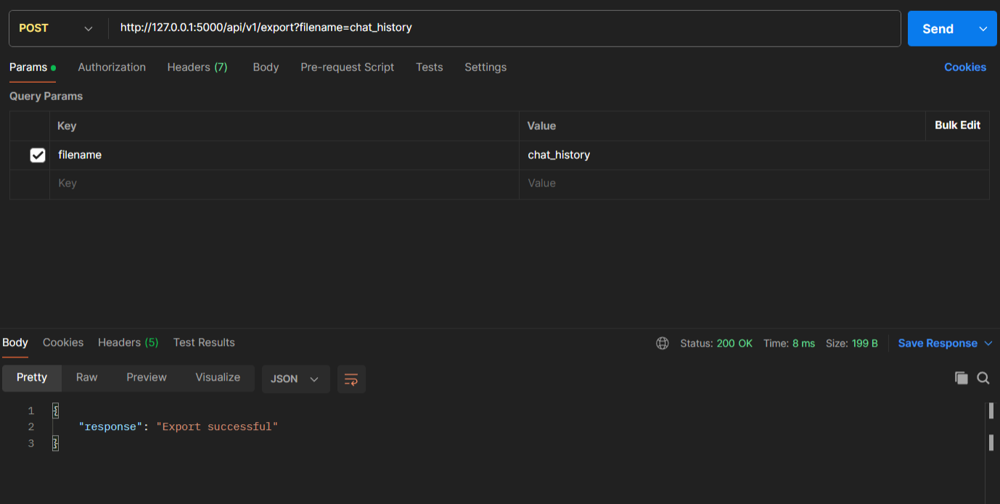

# BetterAssistant

An AI-powered assistant that works via **Command Line Interface (CLI)** and provides **REST API endpoints** for programmatic access (e.g., Postman).  

The agent can answer questions by performing a web search using Tavily, then summarising the web results extracted using a summarisation pipeline which makes use of **facebook/bart-large-cnn** model to create a curated response for the user. 

Once the session is completed, It saves the chat history in .txt format for user to reference later.

---

## LangGraph Workflow for the agent
<p align="center">
  
</p>


## Table of Contents
- [Features](#features)
- [Requirements](#requirements)
- [Installation](#installation)
- [Configuration](#configuration)
- [Usage](#usage)
  - [CLI](#cli)
  - [API](#api)
- [Author](#author)
---

## Features
- Interactive CLI for conversations.
- REST API for integration with Postman or other tools.
- Web search capability using Tavily.
- Context-aware summarisation of response to create curated, well-structured response.
- Uses ChromaDB to store embeddings for queries and responses for faster retrieval of responses next time similar statement is queried.
- Provides the user with an option to save chat to refer to later
- Easy to extend with new agents or workflows.

---

## Requirements
- **Python** >= 3.11
- Dependencies listed in `conda_environment.yaml`
- API keys for:
  - Tavily API

---

## Installation
```bash
# Clone the repository
https://github.com/piyushjasaiwal/BetterAssistant.git
cd BetterAssistant

# Install dependencies
conda env create -f conda_environment.yaml

# Activate conda environment
conda activate betterAssistant
```
# Configuration

Create a `.env` file at the root of the folder and populate it with the API keys

```bash
tavily_api_key = 
```

## Usage

### Using the Agent via CLI

Run the CLI app using command
```bash
python cli.py
```
- Welcome Screen for the CLI interface
<p align="center">
  
</p>

- Demo query and response from the user
<p align="center">
  
</p>

- ChromaDB is initialized as soon as the first query is made by the user and a folder chroma_store is created at the root

<p align="center">
  
</p>

- Exit screen once the conversation ends
<p align="center">
  
</p>

- Saved chat logs in the logs folder
<p align="center">
  
</p>

### Using the Agent via API Endpoints
Run the Flask app using the command
```bash
python flask_app.py
```
The server will start at `http://127.0.0.1:5000`

<p align="center">
  
</p>

### API Endpoints
| Method | Endpoint                                           | Description                   | Example Payload             |
|--------|-----------------------------------------|-------------------------------|-----------------------------|
| POST   | `/api/v1/query`                         | Send a question to the agent  | `{"query": "what is a person"}`|
| POST   | `/api/v1/export?filename=<file-name>`   | Export the chat logs          | —                              |
| GET    | `/`                                     | Check server health           | —                              |

### Example API Usage by Postman

- Check Server Health
<p align="center">
  
</p>

- Send a question to agent
<p align="center">
  
</p>

- ChromaDB is initialized as soon as the first query is made by the user and a folder chroma_store is created at the root

<p align="center">
  
</p>

- Export chat logs
<p align="center">
  
</p>

- Saved chat logs in the logs folder
<p align="center">
  
</p>

## 👤 Author

**Piyush Jasaiwal**   

 [github.com/piyushjasaiwal](https://github.com/piyushjasaiwal)  
 [linkedin.com/in/piyush-jasaiwal](https://www.linkedin.com/in/piyush-jasaiwal/)


